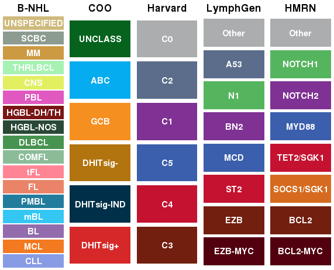
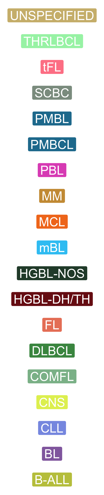

# LLMPP.viz

## Lymphoma-centric colour sets



For HTML versions of these tables with embedded colours, see [this page](https://refined-github-html-preview.kidonng.workers.dev/morinlab/ggsci/raw/master/B-NHL.html).

### General B-NHL subgroups of (or related to) DLBCL

b_cell_nhl_cols=get_colours("b-cell")



|  Pathology  |   hex   |
|:-----------:|:-------:|
| CLL         | #889BE5 |
| MCL         | #F37A20 |
| BL          | #926CAD |
| mBL         | #34C7F4 |
| PMBL        | #227C9D |
| FL          | #EA8368 |
| tFL         | #FF8595 |
| COMFL       | #8BBC98 |
| DLBCL       | #479450 |
| HGBL-NOS    | #294936 |
| HGBL-DH/TH  | #7A1616 |
| PBL         | #E058C0 |
| CNS         | #E2EF60 |
| THRLBCL     | #A5F2B3 |
| MM          | #CC9A42 |
| SCBC        | #8c9c90 |
| UNSPECIFIED | #cfba7c |

## Cell of origin and gene expression subgroups

```r
coo_cols=get_colours("coo")
```

| COO         | hex     |
|-------------|---------|
| DHITsig+    | #D62828 |
| DHITsig-IND | #003049 |
| DHITsig-    | #B1740F |
| GCB         | #F58F20 |
| ABC         | #05ACEF |
| UNCLASS     | #05631E |

## Genetic classes from Chapuy et al

```r
harvard_cols=get_colours("harvard")
```

| Harvard | hex     |
|---------|---------|
| C3      | #721F0F |
| C4      | #C41230 |
| C5      | #3B5FAC |
| C1      | #7F3293 |
| C2      | #5b6d8a |
| C0      | #ACADAF |

## LymphGen classes from Schmitz et al with updates described in Wright et al

```r
lymphgen_cols=get_colours("lymphgen")
```

| LymphGen | hex     |
|----------|---------|
| EZB-MYC  | #52000F |
| EZB      | #721F0F |
| EZB-COMP | #C7371A |
| ST2      | #C41230 |
| ST2-COMP | #EC3251 |
| MCD      | #3B5FAC |
| MCD-COMP | #6787CB |
| BN2      | #7F3293 |
| BN2-COMP | #A949C1 |
| N1       | #55B55E |
| N1-COMP  | #7FC787 |
| A53      | #5b6d8a |
| Other    | #ACADAF |
